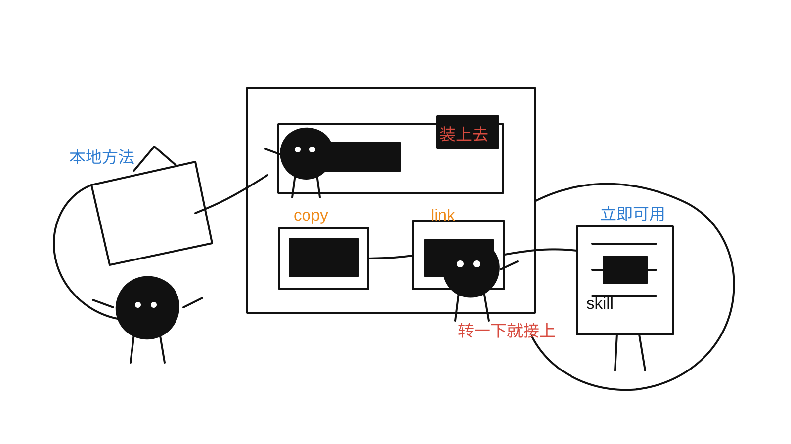

## Skills List


### find skills

```bash
npx skills add vercel-labs/skills@find-skills -g -y
```

没有 find-skills 之前：

- 手动在 GitHub 搜索相关技能
- 逐个复制、安装、配置
- 反复调试适配

有了 find-skills 之后：

- 一句话描述需求
- AI 自动搜索最匹配的技能
- 一键安装，立即可用

### commit-message-generator

自动分析代码改动并生成符合规范的commit信息

```bash
npx skills add xiyueyezibile/xiy-skills@commit-message-generator -g -y
```


功能特性：

- 自动分析git diff的代码改动
- 识别改动类型（feat, fix, docs, style, refactor等）
- 遵循Conventional Commits规范
- 生成一条综合的commit信息（而非多条）
- 支持多文件、多类型改动分析
- 按优先级确定主type（feat > fix > refactor > ...）

### skill-manager

管理和推荐skills的skill，当用户询问该用什么skill时，列出可用的skills、推荐场景和推荐理由

```bash
npx skills add xiyueyezibile/xiy-skills@skill-manager -g -y
```


功能特性：

- 自动发现当前项目中可用的skills
- 根据用户需求推荐合适的skill
- 为每个skill提供推荐场景和推荐理由
- 列出所有可用的skills供用户选择
- 提供安装命令和详细信息

### reply-generator

根据聊天记录、场景描述和模板要求生成自然回复，尽量减少 AI 味，并贴近上下文中的说话习惯

```bash
npx skills add xiyueyezibile/xiy-skills@reply-generator -g -y
```

功能特性：

- 支持根据聊天记录、对话片段或场景描述生成回复
- 支持直接点名模板，或只描述想要的风格
- 默认提供 `2-3` 个候选回复，并明确给出推荐项
- 优先模仿上下文中的说话习惯，再结合模板做微调
- 当场景正式或信息不足时，会自动收敛到更稳的表达

使用示例：

- "帮我回一句，别太官方"
- "按嘉豪的语气回，轻阴阳一点"
- "下面这段聊天给我 3 个版本"
- "帮我回老板一句，礼貌但别太软"

扩展模板：

1. 在 `skills/reply-generator/references/templates/` 下复制 `TEMPLATE.md` 新建一个模板文件
2. 在 `skills/reply-generator/references/INDEX.md` 里补模板索引
3. 在 `skills/reply-generator/references/style-mapping.md` 里补风格触发词映射

这样新增模板时通常不需要修改 `SKILL.md`


### team-pitfalls

团队踩坑收集器：任务开始前先检查已有坑，任务结束后再复盘是否值得沉淀

```bash
npx skills add xiyueyezibile/xiy-skills@team-pitfalls -g -y
```

功能特性：

- 使用时固定包含“前置检查 + 后置复盘”两段动作
- 只记录“新同学不看大概率会写错”的可复用问题
- 先做通用模式判断，再决定是否写入
- 对同类问题做去重与累计次数
- 约束不记录密钥、token、cookie 等敏感信息

### superpowers

覆盖全流程的工作流系统

```bash
npx skills add https://github.com/obra/superpowers
```

### ian-xiaohei-illustrations

Ian 风格的中文正文配图 skill，适合为文章、帖子、博客、Notion 文档和方法论内容生成小黑怪诞手绘配图

```bash
npx skills add https://github.com/helloianneo/ian-xiaohei-illustrations
```

功能特性：

- 面向中文正文配图，而不是商业插画或 PPT 信息图
- 默认使用小黑 IP、纯白手绘、少量红橙蓝批注的视觉风格
- 适合流程、结构、状态、隐喻、观点类内容的正文插图
- 支持先做 shot list，再按单张结构逐张生成

### skill-creator

帮助 skill 创建

```bash
npx skills add https://github.com/anthropics/skills
```

### last30days

最近30天的热点搜索
```
git clone https://github.com/mvanhorn/last30days-skill.git ~/.claude/skills/last30days
```

### btc-trading-analyst

BTC 合约交易分析专家，10 年加密货币合约交易经验

```bash
npx skills add xiyueyezibile/xiy-skills@btc-trading-analyst -g -y
```

功能特性：

- 10年加密货币合约交易经验，专注于 BTC 市场分析
- 结合技术面、消息面和市场情绪进行综合分析
- 中短线交易策略，博弈支撑位和阻力位
- 严格的风险控制规则，以损定杠杆
- 标准化的开仓分析报告输出
- 支持 50倍、25倍等多种杠杆选择
- **内置完整的 K 线形态库**（看涨/看跌形态识别）
- **追涨追空场景库**，包含假突破识别
- 高胜率 K 线形态筛选标准（位置优先、量能配合、趋势确认）
- 形态胜率周期差异分析（日线、周线/月线、分钟线）

### crypto-trading-analyst

任意加密货币合约交易分析专家，支持 BTC、ETH、SOL、DOGE 等主流币种

```bash
npx skills add xiyueyezibile/xiy-skills@crypto-trading-analyst -g -y
```

功能特性：

- 支持 BTC、ETH、SOL、DOGE、XRP、AVAX、MATIC、LINK、DOT、ADA 等主流加密货币
- **分级风险控制**：BTC/ETH 支持 50倍杠杆，其他币种统一使用 5倍杠杆
- **核心交易哲学**：开仓三要素（位置时机 > 趋势止损 > 止盈复利）
- **图表交易三前提**：流动性、博弈性、波动性（缺一不可）
- **折价区间与成交区**：勺柄形态、三底/双底、鲨鱼形态等实战开仓技术
- **内置完整的 K 线形态库**（看涨/看跌形态识别）
- **追涨追空场景库**，包含假突破识别
- 高胜率 K 线形态筛选标准（位置优先、量能配合、趋势确认）
- 形态胜率周期差异分析（日线、周线/月线、分钟线）

## 本地安装方法



### 方式一：直接复制（推荐）

```bash
# 克隆或下载此仓库
git clone https://github.com/xiyueyezibile/xiy-skills.git
cd xiy-skills

# 复制技能到 Claude 技能目录
mkdir -p ~/.claude/skills/
cp -r skills/crypto-trading-analyst ~/.claude/skills/

# 验证安装
ls -la ~/.claude/skills/crypto-trading-analyst/
```

### 方式二：使用 skills CLI（需要先安装 skills）

```bash
# 安装 skills CLI（如果还没有）
npm install -g @anthropic-ai/skills

# 添加技能
npx skills add xiyueyezibile/xiy-skills@crypto-trading-analyst -g -y
```

### 方式三：手动创建符号链接（开发模式）

```bash
# 克隆仓库
git clone https://github.com/xiyueyezibile/xiy-skills.git
cd xiy-skills

# 创建符号链接到 Claude 技能目录
mkdir -p ~/.claude/skills/
ln -sf $(pwd)/skills/crypto-trading-analyst ~/.claude/skills/

# 这样修改代码后立即生效，无需重新复制
```

## 使用示例

安装后，在 Claude 中直接说：

- "帮我分析 BTC 市场并给出开仓建议"
- "分析 ETH 的行情，应该做多还是做空？"
- "请分析 SOL 的技术面和消息面"
- "DOGE 现在怎么样？适合做空吗？"

如果没有指定币种，会先询问您要分析哪个加密货币。
